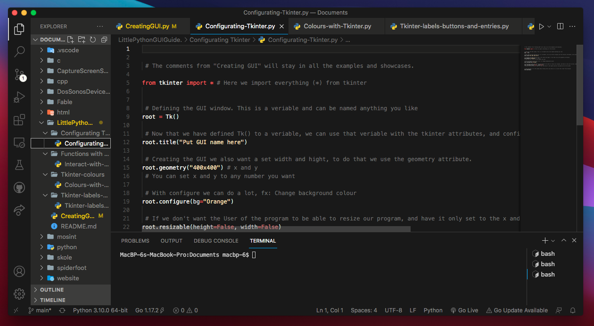

# LittlePythonGUIGuide.

This is a short GUI Guide with python, learning how to use the simple and easy moduel built into python, named tkinter.
This short tutorial / Guide shows the fundamental and beginner things to know when creating a GUI in python, with the easy moduel tkinter.

Download python

Windows / Mac:
```css
https://www.python.org/downloads/
```
GNU/Linux (apt)
```bash
sudo apt update
sudo apt install python3
```
GNU/Linux (pacman)
```bash
sudo apt -Syu
sudo pacman -S python3
```

Clone the reposetory, if you want to take a look at it in a text editor or something else.
```bash
git clone https://github.com/CollinEdward/LittlePythonGUIGuide..git
```



